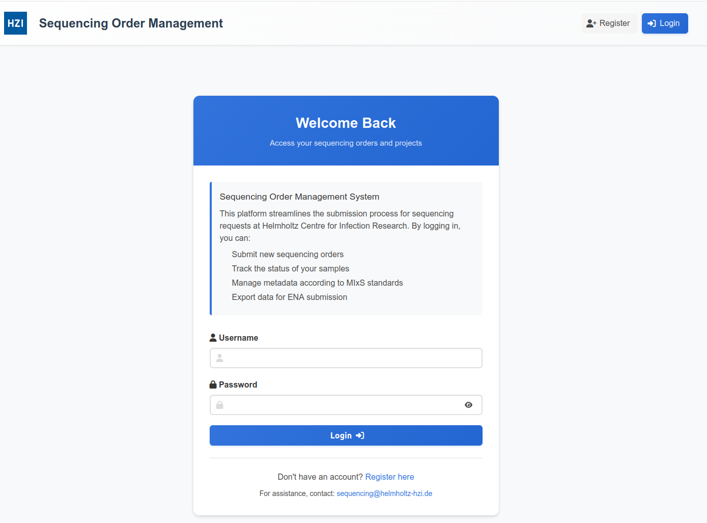

Usage
=====

.. _access:

Access
------

To access a demo installation of the SOMS, point a browser at: https://broker-demo.bifo.helmholtz-hzi.de.

Note that all data entered will be deleted nightly at 00:01 CET.

Registration
------------

Access to the application requires an account to be created, so that information gathered can be associated with a specific user.

To register for access:

Click 'Register' (1a)  or 'Register here' (1b).

Supply a username (1) and password (2), ensuring that the password complies with the password rules shown. Click 'Create Account' (3).

Once created, the user remains logged in.

Create a project
----------------

A project is a mandatory construct used to gather all sequences and metadata for a specific research project.

Create a project by clicking 'Create Your First Project' (1).

At a minimum, populate the 'Title' (1)  and 'Alias' (2) fields, and then click 'Submit project' (3).

Create an order
---------------

An order is a collection of samples and associated metadata / analyses within a project, sequenced at the same time.

Create an order by clicking 'View Orders' (1) and on the following screen, by clicking 'Request New Order' (1).

At a minimum, populate the (customer) 'Name' (1) field and then click 'Create Order' (2).

Configuring checklists for an order
-----------------------------------

After the generic order metadata has been captured, a MIxS checklist should be chosen, to determine which metadata needs to be captured for the sequences in this order.

Click 'Setup Checklists' (1).

On the following screen, click the desired checklist eg. (1) and then click 'Proceed to Sample Data' (2). 

When the most appropriate checklist is not yet known, a search term corresponding to a field which may be present in a checklist can be entered in the box at (3). Suitable checklists will be shortlisted.

The fields in a checklist can be previewed by clicking eg. (4), as shown at (5).

Any particular checklist is likely to contain more fields than can expected to be populated. The actual fields presented to allow metadata to be entered can be chosen by clicking 'Customize Fields' (6). On the follwing screen, the total number of fields for a particular checklist, and the number of which are mandatory and optional are shown in (1). Mandatory fields are shown in red boxes (2), whereas optional fields are shown in blue (2). The latter can be deselected by clicking the checkbox to the left of each box (3). All optional fields can deselected, or reselected using (4). Specific fields can be located by entering a seach term into the box at (5). The field selection choices can be finalised by clicking 'Save and Continue' (6).

Adding sample data to an order
------------------------------

Once a checklist has been chosen for an order, the sample data relating to the order can be entered, by clicking on 'Add Sample data' (1). On the following screen, a spreadsheet is shown in which the data for multiple samples can be entered (1).

The initial row should be deleted, by clicking 'Delete' in row 1 (1) and then a new sample row can be added by clicking 'Add Sample' (2). The newly added sample will then have a unique sample ID (3). 

Those fields which have a green column heading are generic sample fields, those in blue, pertain to the chosen checklist, and those in grey are optional checklist fields (3).

Sample test data can be obtained from the 'Samples' worksheet in test_data.ods. The first row can be selected from the spreadsheet file and and pasted in to the online spreadsheet, starting from the first field (tax_id) (4). The 'Save Samples' button (5) should then be clicked, followed by 'Back to Orders' (6). If there are any field validation issues, these will be highlighted with a dialog (7).

Submitting the order for sequencing
-----------------------------------

Prior to submitting physical samples, it is necessary to confirm that all stages of data entry have been completed. This can be done by checking the three checkboxes (1) and then clicking 'Submit for Sequencing' (2). A dialog will then be shown describing the steps for providing the physical samples to the sequencing facility (3). This should be acknowledged by clicking 'Confirm Submission' (4).

At this point, the status of the order has now changed from 'Draft' to 'Ready for Sequencing', and the subsequent steps are performed by the sequencing facility.

Accessing the sequencing facility functionality
-----------------------------------------------

In the demo environment, when a new user registers, they are automatically registered as a staff member, and so can access the sequencing facility functionality. In the normal case, access to this needs to be expliclity granted, as described in 'Normal process for adding a user as a staff member'.

The sequencing facility administration functionality can be accessed via the /admin-dashboard URL.

That there is one order requiring processing, is shown at (1), and (2).

The facility management workflow is approximately:

Create sequences (applicable only in the development environment) and detect -> register project with ENA -> create MAG pipeline input (to create assemblies, bins, MAGs) and run MAG pipeline -> create samples to represent MAG products -> create SubMG input (for order metadata, reads, MAG products) and run SubMG

Creating simulated read files
-----------------------------

When the environment is used in a productive environment, sequencing files will be created from the physical samples received using a sequencing device. The files will be stored in storage location accessible to the Django application.

In the case of the demo environment, this step can be simulated by creating test sample files. This can be done by clicking on 'Orders' (1) and then by clicking 'View' (2) in the appropriate order.

Within the order, simulated reads can be created by clicking on 'Simulate Reads' (1) and confirm the dialog with 'OK' (2).

Checking for read files
-----------------------

Read files (whether simulated, or real) which pertain to the current sample can be detected by clicking on 'Check for Read Files' (1) and confirming the dialog with 'OK' (2). That the files have been recognised can be seen in (1).

Register the project with ENA
-----------------------------

As SubMG does not handle project registration with ENA, this step is performed independently within the application. To do this, click 'Projects' (1) and then click 'View' (2) on the appropriate project.

On the subsequent screen, click 'Generate ENA XML' (1) and confirm the dialog with 'OK' (2). On revisiting the project by clicking again 'View', the prepared ENA submission can be seen by opening the down arrow at (1), and this can be registered with ENA by clicking 'Register at ENA' (2) and clicking 'OK' (2) to confirm the dialog.

On revisiting the project once more by clicking 'View', the prepared ENA submission can be seen by opening the down arrow at (2) and browsing the Receipt XML (3). The accession ID received from ENA is also used to update the project (1).

Rub MAG pipeline
----------------

Running a MAG pipeline allows analysis products to be generated from the sequenced files, specifically assemblies, bins and metagenome-assembled genomes (MAGs).

In a productive enviroment, these are created by the Django portal running a Nextflow MAG workflow. This however is a time-consuming process, and in the demo environment simulated files are created, but the process to create the files is the same.

To create the workflow input, click 'Create MAG Run' (1) and confirm the dialog with 'OK' (2). The created workflow input can then be run by clicking 'Run' (1) and confirming the dialog with 'OK' (2).

After a period of time (approx 30s in the demo environment, hours in a productive environment), after refreshing in the browser, the MAG run will changed to state 'completed' (1) and the MAG products can be explored (2).

Create samples to represent MAG products
----------------------------------------

After the MAG products have been created by the sequencing facility, appropriate samples need to be created, so that metadata can be associated with the products, such that when the project components are uploaded to ENA, the metadata is attached. As this metadata needs to be supplied by the user, rather than the sequencing facility, and may not be known prior to the MAG pipeline having been run (for example taxon ids of isolates), this step needs to be performed by the user submitting the sequencing request, rather than the sequencing facility staff.

Point a browser at the home URL (as the submitting user, if currently logged in as a separate staff user)

Within the relevant project, click on 'View Orders' (1) and then for each of the buttons under 'Optional Analysis Samples' (2). These allow metadata to be captured for generated assemblies, bins and MAGs.

Within each of these sections, after deleting the existing row by clicking 'Delete' (1) and adding a new roow by clicking 'Add Sample' (2), the data can copied and pasted in from test_data.ods, starting from the tax_id column (3) and the 'Save Samples' clicked (4). Source worksheets are as follows:

Assembly: Samples - column A-E, select assembly, then remaining columns (F-...)
Bins: new_bins - column A-E, select bin, then remaining columns (F-...)
MAGs: new_mag - all columns

The columns assembly_identifier, bin_identifier and mag_identifier (in each secxtion, respectively) refer to the id of the assemblies, bins and MAGs created. There should be a row created for item created within each class.

Pasting should be done with <ctrl>-v.

Generate SubMG run
------------------

The SubMG tool is used to submit the objecs contained under the project (samples, reads, assemblies / bins / MAGs) to ENA. The input to the tool needs to be constructed first, and this can be constructed by working again with the URL /admin-dashboard (connecting again with a sequencing facility user when necessary),  clicking 'Generate SubMG Run' (1) and confirm the dialog with 'OK' (2). The SubMG tool can then be run using this input by clicking on 'Run SubMG' (1) and confirming the dialog with 'OK' (2). The status for the SubMG run will change from 'pending' to 'running' and then in a short-period of time to 'completed'.

The uploaded products can be viewed on the ENA webpage (https://wwwdev.ebi.ac.uk/ena/submit/webin/) (1).

Workflow states
---------------

By submitting the project to ENA, running the MAG workflow, and submitting the products to ENA, the project workflow will be shown as completed in the portal (1). The order workflow should be manually advanced though. When an order has been sequenced, the order should be opened (1), 'Actions' clicked (2), and 'Advance to Sequencing_In_progress' (3). The inew status can be selected dialog can then be confirmed with 'Update Status' (1). Alternatively, the order can be rejected by clicking 'Reject with Feedback' (1).

Normal process for adding a user as a staff member
--------------------------------------------------

When AUTO_CREATE_USERS_AS_ADMIN is not set to True in project/project/settings.py, a superuser needs to exist to manage user access. This user can be created on the machine running the Django server within the root of the Django server as:

python project/manage.py createsuperuser

This user can then be used to log in when prompted (1), after going to the /admin/auth/user URL on the Django server. The user who should be given staff status should be clicked (1) and then on the following screeen, the 'Staff status' checkbox (1) selected, and then 'SAVE' (2) clicked.

The superuser account can then be exited, by clicking 'LOG OUT' (1).

Documentation todo
------------------

Add Dummy Data (project) link
Order status / workflow
Checklist search is only on title
Delete initial field in spreadsheet
Multiple samples
Performance
Sample data
How to get back to non-admin workflow
Psueod samples are per order
Delete row and recreate

To use Lumache, first install it using pip:

.. code-block:: console

   (.venv) $ pip install lumache

Creating recipes
----------------

To retrieve a list of random ingredients,
you can use the ``lumache.get_random_ingredients()`` function:

.. autofunction:: lumache.get_random_ingredients

The ``kind`` parameterx should be either ``"meat"``, ``"fish"``,
or ``"veggies"``. Otherwise, :py:func:`lumache.get_random_ingredients`
will raise an exception.

.. autoexception:: lumache.InvalidKindError

For example:

>>> import lumache
>>> lumache.get_random_ingredients()
['shells', 'gorgonzola', 'parsley']

